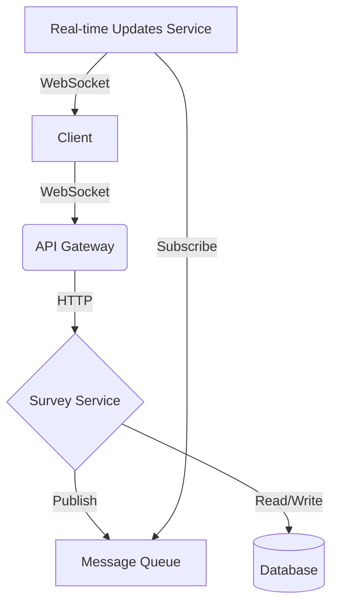

# 🚀 Awesome Survey App 📊

Welcome to the most **epic**, **scalable**, and **cloud-native** survey application you've ever laid eyes on! 🎉

## 🌟 Features

- 🔒 Secure user authentication with cookie-based sessions
- 🔄 Real-time updates using WebSocket technology
- 📱 Responsive design for seamless mobile and desktop experiences
- 🧠 Smart caching mechanisms for blazing-fast performance
- 🔌 Easily extensible architecture for adding new question types

## 🛠️ Tech Stack

- **Backend**: Go (Golang) 🐹
- **Web Framework**: Echo 🔊
- **WebSockets**: Gorilla WebSocket 🦍
- **Configuration**: YAML 📄
- **Frontend**: HTML, CSS, JavaScript 🎨
- **Concurrency**: Go routines and channels 🔀

## 🚀 Quick Start

1. Clone this repository:
   ```
   git clone https://github.com/yourusername/awesome-survey-app.git
   ```

2. Install dependencies:
   ```
   go mod tidy
   ```

3. Configure your survey in `config.yaml`:
   ```yaml
   name: "My Awesome Survey"
   token: "your-secret-token"
   secret: "your-admin-secret"
   survey:
     - type: "multiple"
       question: "What's your favorite programming language?"
       answers:
         - "Go"
         - "Python"
         - "JavaScript"
         - "Rust"
   ```

4. Run the application:
   ```
   go run main.go
   ```

5. 🎉 Open `http://localhost:8000` and start surveying!

## 🏗️ Architecture

Our Awesome Survey App leverages a microservices-based architecture with event-driven communication:



## 🔒 Security

We take security seriously! Our app implements:

- 🔐 HTTPS encryption
- 🍪 Secure, HTTP-only cookies
- 🛡️ CSRF protection
- 🔑 Rate limiting

## 🚀 Scaling

This app is built to scale! Here's how we handle millions of concurrent users:

- 📦 Containerized with Docker for easy deployment
- ☸️ Kubernetes-ready for orchestration
- 📈 Horizontal scaling of WebSocket connections
- 🗄️ Distributed caching with Redis

## 🤝 Contributing

We welcome contributions! Please check out our [Contribution Guidelines](CONTRIBUTING.md) for more information.

## 📜 License

This project is licensed under the MIT License - see the [LICENSE](LICENSE) file for details.

## 🙌 Acknowledgments

- Shoutout to the awesome Go community! 🐹
- Thanks to all the open-source projects that made this possible! 🌟

---

Built with ❤️ by the Awesome Survey App Team (me)